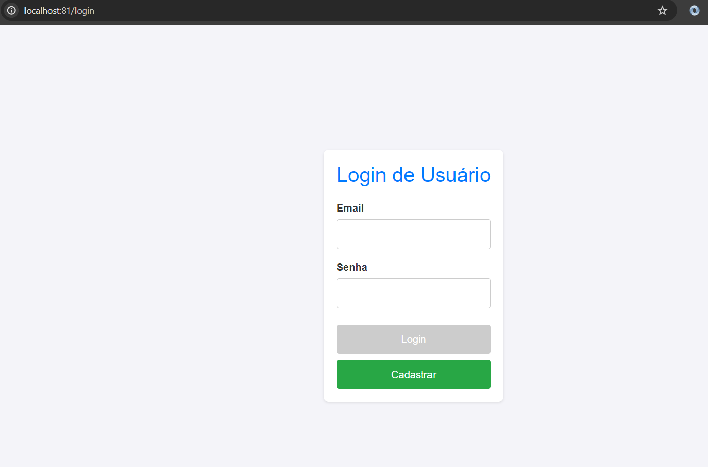
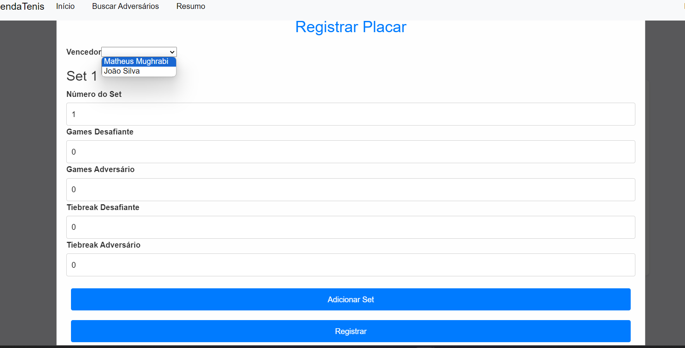

# AgendaTenis
## Índice

- [Sobre](#sobre)
- [Features](#features)
- [Valores de domínio](#valores_dominio)
- [Descrição técnica do sistema](#descricao_tecnica)
- [Como executar](#como_executar)
- [Exemplo de uso da API](#exemplo_uso)
- [Considerações sobre o projeto](#consideracoes)

## Sobre

Agenda Tênis é uma aplicação web na qual tênista de todos os níveis podem se cadastrar e encontrar adversários para agendar partidas.

## Considerações iniciais
### Nomenclatura
Segue a nomenclatura que será adotada ao longo desta documentação:
- Front-end da aplicação: AgendaTenis.WebApp
- Identity Serviço: AgendaTenis.Identity
- Jogadores Serviço: AgendaTenis.Jogadores  
- Partidas Serviço: AgendaTenis.Partidas
- Cidades Serviço: AgendaTenis.Cidades

### Sobre a documentação
O presente repositório consiste do front-end da aplicação AgendaTenis e será chamado de AgendaTenis.WebApp.\
Por ser a porta de entrada e se comunicar com todos os microsserviços do ecossistema da aplicação decidi incluir alguns detalhes técnicos específicos dos microsserviços com os quais ela se comunica.\
Para saber mais sobre cada microsserviço, consulte a documentação em seus respectivos repositórios.

## Descrição técnica
A seguir vou apresentar a topologia completa da aplicação e descrever todos os serviços que fazem parte do ecossistema da aplicação Agenda Tênis.

### Topologia da aplicação
A imagens abaixo ilustra a topologia da aplicação.

Destaca-se:
1. O usuário interage diretamente apenas com o front-end AgendaTenis.WebApp
2. AgendaTenis.WebApp depende dos microsserviços a seguir:
    - AgendaTenis.Identity
    - AgendaTenis.Jogadores
    - AgendaTenis.Partidas
    - AgendaTenis.Cidades
3. Os microsserviços abaixo possuem um banco de dados próprio
    - AgendaTenis.Identity (SQL Server)
    - AgendaTenis.Jogadores (Postgresql)
    - AgendaTenis.Partidas (MongoDb)
4. A aplicação possui um Redis compartilhado para armazenar dados em cache
5. A aplicação AgendaTenis.Partidas emite um evento chamado PlacarConfirmado
6. A aplicação AgendaTenis.Jogadores consome o evento PlacarConfirmado para atualizar a pontuação dos jogadores envolvidos
7. A aplicação AgendaTenis.Cidades comunica-se com uma API externa do IBGE chamada *API de localidades*

## Como executar 
1. git clone {repourl}
2. cd .\AgendaTenis.WebApp\
3. docker-compose up

Observação: É um pré-requisito que você tenha o docker instalado em sua máquina

## Guia básico de uso
As seções a seguir ilustram as features da aplicação.
Nas seções a seguir vou assumir que você utilizou o docker-compose.yaml presente no repositório e, com isso, a porta que o Nginx (web server da aplicação) escuta é a 81

### Acessar a aplicação
Para acessar a aplicação utilize o link http://localhost:81/login
Ao acessar este link você estará na tela de login abaixo

### Cadastro de usuários
Para cadastrar um usuário acesse o link http://localhost:81/cadastro ou clique no botão *cadastrar* presente na tela de login
Segue a tela de cadastro

Em seguida, basta digitar um e-mail que ainda não foi cadastrado, uma senha com ao menos 10 caracteres, confirmar a senha e clicar em *Cadastrar*.
Após clicar em cadastrar você receberá uma mensagem indicando que o cadastro foi realizar com sucesso ou se houve alguma falha (e-mail já cadastrado, por exemplo).

### Login
Na tela de login basta inserir um e-mail e senha cadastrados e você será redirecionado para a tela completar perfil (caso seja seu primeiro acesso) ou para a tela inicial (caso já tenha completado seu perfil anteriormente)

### Completar Perfil
Após realizar login pela primeira vez você será redirecionado para a tela *completar perfil*.
Nesta tela você poderá preencher as informações pessoais do seu perfil de tenista.
Segue a tela de completar perfil

Após preencher seus dados, clique no botão Completar Perfil e você será redirecionado para a tela inicial da aplicação que contém o histórico de partidas.

### Histórico de partidas
Na tela histórico de partidas, você poderá ver todas as partidas que foi convidado, aceitou/recusou convite e as partidas antigas que já realizou.

### Buscar Adversários
Para buscar adversários, clique em Buscar Adversários na barra de navegação.

Utilize os filtros Cidade e Categoria se desejar filtrar os adversários disponíveis.

### Convidar para partida
Para convidar um adversário para uma partida clique no botão Convidar na tela buscar adversários

O modal a seguir abrirá

Escolha a cidade que você deseja realizar a partida e o número de sets da partida (Modelo da Partida) e clique em convidar.

Você será redirecionado para a tela inicial (histórico de partidas) e poderá ver a partida criada.

### Detalhes de uma partida
Na tela histórico de partidas, clique em Detalhes para ver mais detalhes da partida.
O modal abaixo abrirá.

### Aceitar/Recusar convite
Se você for o adversário da partida, ao acessar os detalhes da partida poderá visualizar o botão "Aceitar" e o botão "Recusar".

### Registrar Placar
Ao abrir o modal de detalhes da partida você poderá registrar o placar se as condições a seguir forem verdadeiras:
- Você é o desafiante da partida
- O adversário da partida já aceitou o convite
- A data atual é maior do que a data da partida

A figura a seguir ilustra o botão Registrar

Após clicar em Registrar o modal abaixo abriráa

Preencha os dados do placar da partida e clique em registrar.

### Confirmar/Contestar Placar
Após o desafiante registrar o placar da partida, o adversário pode confirmar a veracidade do placar ou contestar.

Se o adversário confirmar o placar, então o vencedor da partida ganhará 10 pontos e o perdedor perderá 10 pontos (até um mínimo de zero pontos).
Se o adversário contestar o placar, nenhum dos jogadores tem a pontuação alterada

### Resumo do jogador
Para acessar a tela resumo do jogador, clique em Resumo na barra de navegação.
Nesta tela você poderá ver um resumo útil de seu perfil de tenista.

## Considerações sobre o projeto 
1. Hoje só é possível convidar 1 jogador para a partida, ou seja, o sistema ainda não suporta partidas de duplas
2. Ainda não criei testes de unidade. É algo que está no backlog.
3. Não houve tempo hábil para incluir um api gateway entre o front-end e os microsserviços. Futuramente ele será incluído (provavelmente vou utilizar o Kong)
4. No docker-compose.yaml
   - Configurei os microsserviços para expor as portas para o host, isso foi necessário para que não haja problemas para o front-end se comunicar com os microsserviços. Quando o Api gateway for incluído, vou atualizar o docker-compose.yaml para não expor as portas do microsserviços
   - Configurei os microsserviços para expor portas http. Isso não é indicado para ambientes produtivos.
